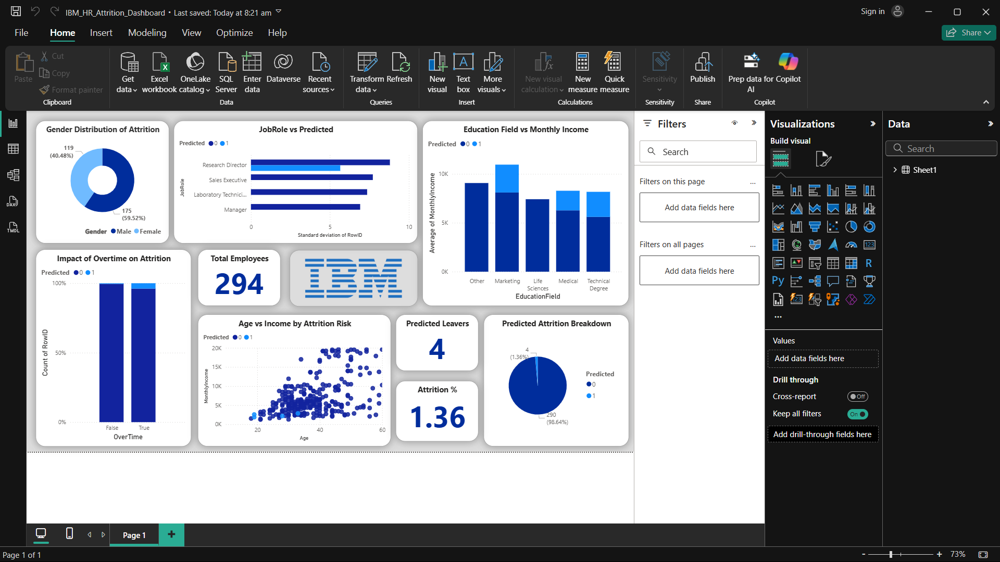

# 🧑‍💼 IBM HR Attrition Dashboard

This project explores why employees leave a company, using IBM’s HR analytics dataset. With the help of **SQL**, **Python**, and **Power BI**, I’ve built an interactive dashboard that highlights key trends in employee attrition.

It’s designed to help HR teams and decision-makers understand what factors lead to turnover—and how to address them.

---

## 📁 What’s Inside

- `IBM_HR_Attrition_Dashboard.pbix` — The interactive dashboard built in Power BI
- Cleaned and analyzed data using SQL and Python before visualizing

---

## 🛠 Tools Used

- **SQL** – Pulled and filtered relevant data
- **Python** – Cleaned and analyzed the dataset (with `pandas`, `seaborn`, `matplotlib`)
- **Power BI** – Built the final dashboard with slicers, KPIs, and visuals

---

## 🔍 What You’ll See in the Dashboard

- **Attrition breakdowns** by department, job role, gender, and age
- Insights on **job satisfaction**, **work-life balance**, and **overtime**
- Performance and compensation data like **monthly income** and **promotions**
- Fully **interactive filters** to explore data from multiple angles

---

## 🖼 Dashboard Preview

### Desktop View

### Mobile View

---

## 🎯 Why This Matters

Employee turnover is costly. By understanding why people leave, companies can improve retention, culture, and performance. This project shows how data can lead the way.

---

## ▶️ How to Use

1. Download or clone this repo
2. Open `IBM_HR_Attrition_Dashboard.pbix` in [Power BI Desktop](https://powerbi.microsoft.com/desktop/)
3. Explore and interact with the visuals to gain insights

---

## 📊 Data Source

- [IBM HR Analytics Employee Attrition & Performance (Kaggle)](https://www.kaggle.com/datasets/pavansubhasht/ibm-hr-analytics-attrition-dataset)

---

## 📫 Let’s Connect

Have suggestions or want to collaborate? Feel free to reach out or open an issue!
